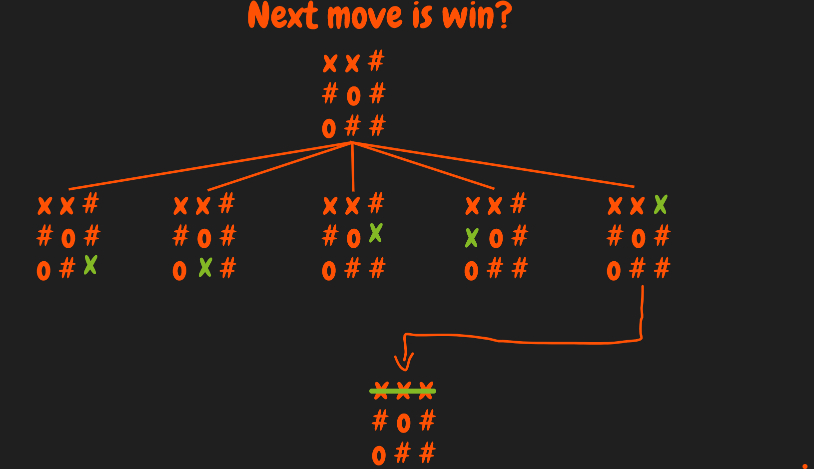
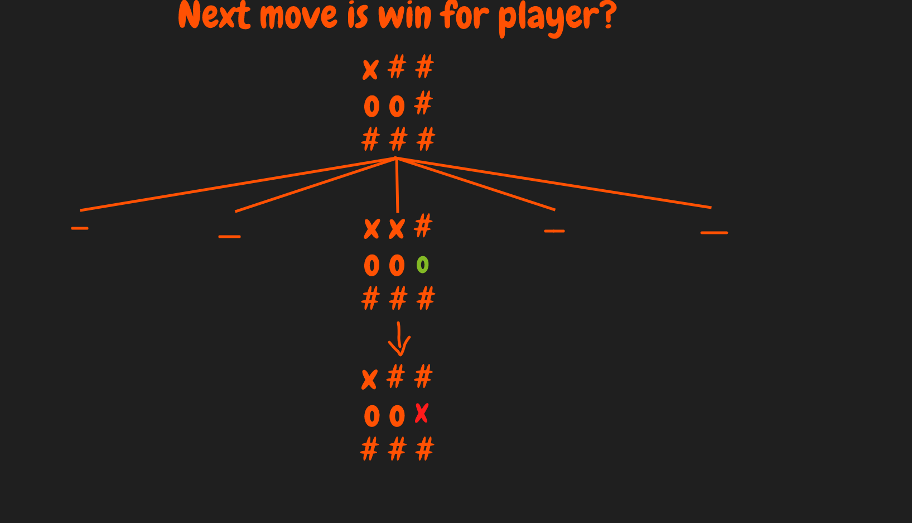
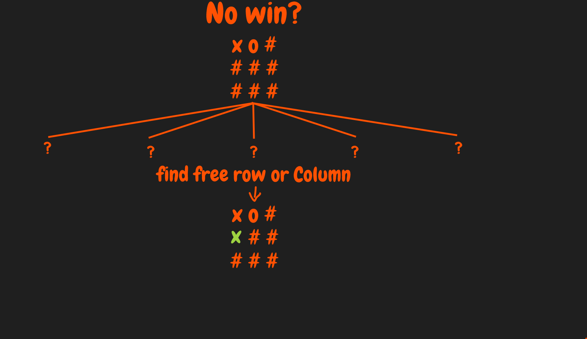

# Before anything.
- if u like my projects Follow my Account and give my repo star :D
- my discord if u want any help ...

# some concepts you need to know before we start the Algorithm Explanation
- this Algorithm have 3 main moves which is:
- Next move is win for A.I?
- Next move is win for player?
- No win?
- column-1 = [1,4,7] column-2 = [2,5,8] column-3 = [3,6,9]
- row-1 = [1,2,3] row-2 [4,5,6] row-3 = [7,8,9]
- diagonal-1 = [1,5,9] diagonal-2 = [3,5,7]

# Next move is win for A.I?
- it start by trying all the moves possible for the next move
- then it start check if it's win or not
- like This:

# Next move is win for player?
- if it's not win for A.I it start check for the player
- it start by trying all moves possible for the player
- and check if it's win or not
- like This:

- then it block it so the player don't win :D

# no Win?
- if next move not win for A.I and the player

# Thank You so much for watching all the repo :)
